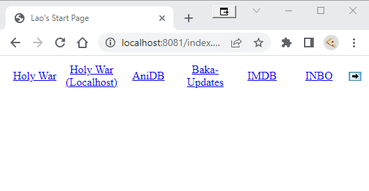

Starter-Page
============

Start this beauty:


```sh
docker run --rm -d -p 8081:80 -v C:\code\www\old\start:/server --mount type=bind,source="C:\code\www\old\start",target=/var/www/html php:apache
```

And surf to `http://localhost:8081/index.php`


## Screenshot

Watch and be awed:




Also note that there is an arrow to go to the **next** menu!!
